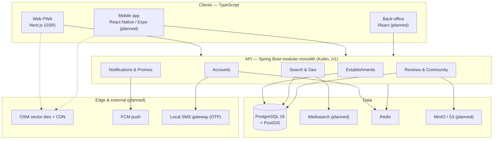

# 🍲 Fikaliako — Geolocated Food Discovery for Madagascar


**Fikaliako** (Malagasy: _"what I'm going to eat"_) answers the daily question of millions of Malagasy people — _« Aiza no hisakafo androany ? »_ (where do I eat today?) — by position, budget, and craving. It is an interactive map of **all** the food offering in Madagascar, where gargottes and street vendors are first-class citizens alongside restaurants: real prices in ariary, real opening hours, mobile-money payment info, and community-verified data.

> [!NOTE]
> The functional and technical reference for this project is the **project book** — _Fikaliako, Livre de Projet v1.0_ (July 2026), kept outside the repo. Every v1 development decision must be justifiable by a section of it; code comments cite it as "project book ch. N". This README covers day-to-day development of the monorepo.

---

## Table of Contents

- [🍲 Fikaliako — Geolocated Food Discovery for Madagascar](#-fikaliako--geolocated-food-discovery-for-madagascar)
  - [Table of Contents](#table-of-contents)
  - [Overview](#overview)
  - [Features](#features)
  - [Tech Stack](#tech-stack)
  - [Architecture](#architecture)
  - [Project Structure](#project-structure)
  - [Prerequisites](#prerequisites)
  - [Getting Started](#getting-started)
    - [1. Clone the repository](#1-clone-the-repository)
    - [2. Install dependencies](#2-install-dependencies)
    - [3. Start the stack](#3-start-the-stack)
  - [Environment Variables](#environment-variables)
  - [Available Scripts](#available-scripts)
  - [Backend (Spring Boot API)](#backend-spring-boot-api)
    - [Local services (Docker Compose)](#local-services-docker-compose)
    - [Database \& migrations](#database--migrations)
    - [API contract (OpenAPI)](#api-contract-openapi)
    - [Security model](#security-model)
  - [Testing](#testing)
  - [Roadmap](#roadmap)
  - [Coding Conventions](#coding-conventions)
  - [Troubleshooting](#troubleshooting)
  - [License](#license)

---

## Overview

Finding where to eat in Madagascar is surprisingly hard — not because the offer is lacking, but because the **information** is: Facebook has no distance/budget/hours filters, Google Maps ignores most gargottes, prices are rarely displayed, and opening hours are folklore. Fikaliako attacks the information problem with a map dedicated exclusively to food, enriched and kept alive by its community.

**Highlights (target product, book ch. 4):**

- Full-screen interactive map (OpenStreetMap + MapLibre, client-side clustering, open/closed status in real time)
- Four combinable search modes: text (typo-tolerant), **budget in ariary** (the king filter — a 4-tranche slider), distance radius, and natural-language "smart search"
- Twelve one-query boolean filters: open now · open 24h · delivery · parking · wifi · terrace · family · romantic · student · AC · view · mobile payment
- Establishment pages with real prices, hours, photos, payment methods (MVola · Orange Money · Airtel Money), and 5-criteria reviews
- Community contributions with moderation: add a missing gargotte, fix hours/prices, report closures
- Phone-number accounts (OTP SMS), favorites, purgeable history — browsing never requires an account

**Status: early bootstrap.** The monorepo, the API skeleton (health endpoint, security shell, PostGIS schema foundation), and the web app shell are in place. The establishments, search, community, and accounts modules are next — see [Roadmap](#roadmap).

---

## Features

The target user journey (book ch. 4 — each stage is a functional block):

| Stage            | Description                                                                     |
| ---------------- | ------------------------------------------------------------------------------- |
| **Opening**      | "I'm hungry" → geolocation, map centered on the user.                           |
| **Exploration**  | Map + filters (budget, distance, attributes); live result counts.               |
| **Decision**     | Establishment page: prices in Ar, today's hours, photos, reviews on 5 criteria. |
| **Visit**        | Directions, call, or delivery.                                                  |
| **Contribution** | Rate, photograph, correct data — the community loop that keeps the map alive.   |

---

## Tech Stack

Two languages, no more (book ch. 7): **Kotlin server-side, TypeScript client-side**.

| Layer                       | Technology                                                                                                             |
| --------------------------- | ---------------------------------------------------------------------------------------------------------------------- |
| **Monorepo**                | [Turborepo](https://turborepo.dev/) 2 · pnpm 9 workspaces — the Gradle-built API is driven as a workspace package      |
| **Web**                     | [Next.js](https://nextjs.org/) 16 (SSR — every establishment page must be Google-indexable) · React 19                 |
| **Mobile** _(planned)_      | React Native (Expo) + MapLibre Native — Android first, then iOS                                                        |
| **Back-office** _(planned)_ | React — moderation queues, roles, quality dashboard                                                                    |
| **API**                     | Kotlin 2.3 · Spring Boot 4.1 · JVM 21 (Gradle Kotlin DSL, wrapper committed, JDK auto-provisioned via foojay)          |
| **Database**                | PostgreSQL 16 + [PostGIS](https://postgis.net/) — native `GEOGRAPHY(Point,4326)`, GiST + trigram indexes               |
| **ORM / spatial**           | Spring Data JPA · `hibernate-spatial` (JTS)                                                                            |
| **Migrations**              | [Flyway](https://flywaydb.org/) — sole owner of the schema (`ddl-auto: validate`)                                      |
| **Search** _(planned)_      | [Meilisearch](https://www.meilisearch.com/), synced from Postgres — typo-tolerant FR/MG search                         |
| **Cache & queues**          | Redis 7 — cache, rate limiting, OTP queues, revocable refresh tokens                                                   |
| **Files** _(planned)_       | MinIO (S3-compatible) — photos compressed client-side, thumbnails at upload                                            |
| **Maps** _(planned)_        | OpenStreetMap vector tiles (Planetiler) behind a CDN, rendered by MapLibre GL                                          |
| **API contract**            | Hand-managed OpenAPI 3.1 spec served at `/v1/openapi.yaml` · self-hosted Swagger UI at `/v1/docs`                      |
| **Auth**                    | Spring Security, stateless — short JWTs + Redis-revocable refresh tokens, OTP SMS signup _(accounts module, upcoming)_ |
| **Observability**           | Spring Actuator (`health` · `info` · `metrics`) — Prometheus + Grafana planned                                         |
| **Delivery** _(planned)_    | Docker Compose on VPS · GitHub Actions (build, tests, deploy)                                                          |

---

## Architecture

A **modular monolith** (book ch. 7.1): one Spring Boot deployable split into feature packages with strict boundaries — extractable into services later if a module runs hot. Microservices were explicitly rejected (small team, one deployment, one database, zero internal network to debug).



**Key decisions (book ch. 7.1):**

- **One source contract**: the OpenAPI spec is hand-managed and versioned with the code; controllers are implemented _against_ it and TypeScript client types are generated _from_ it.
- **Geo stays in SQL**: the core query — "open establishments within 1 km, cheapest first" — runs natively on PostGIS with `ST_DWithin` (never raw distance math, so it stays on the GiST index).
- **SSR for SEO**: every establishment page is a Next.js page indexable by Google — a primary organic acquisition channel.
- **Privacy by design** (book ch. 9): location is used on the fly and never stored as a trajectory; history is user-purgeable; any published statistics are aggregated with k-anonymity ≥ 20.

---

## Project Structure

```
fikaliako/
├── apps/
│   ├── api/                        # Spring Boot API (Kotlin, Gradle)
│   │   ├── build.gradle.kts        #   Dependencies, JVM 21 toolchain, bootRun wiring
│   │   ├── package.json            #   pnpm scripts → Gradle (build, dev, test, clean)
│   │   ├── turbo.json              #   Gradle outputs for Turborepo caching
│   │   └── src/main/
│   │       ├── kotlin/mg/fikaliako/api/
│   │       │   ├── config/         #   SecurityConfig, WebConfig
│   │       │   ├── health/         #   /v1/ping
│   │       │   └── …               #   establishments, search, community, accounts (upcoming)
│   │       └── resources/
│   │           ├── application.yml
│   │           ├── db/migration/   #   Flyway migrations (V1__init.sql: PostGIS + core tables)
│   │           └── static/v1/
│   │               ├── openapi.yaml       # ← the hand-managed API contract
│   │               └── docs/index.html    #   Swagger UI page
│   └── web/                        # Next.js app (App Router)
│       └── app/
├── packages/
│   ├── api-client/                 # Typed API client generated from the OpenAPI contract (@fikaliako/api-client)
│   ├── ui/                         # Shared React components (@fikaliako/ui)
│   ├── eslint-config/              # Shared ESLint configs (@fikaliako/eslint-config)
│   └── typescript-config/          # Shared tsconfigs (@fikaliako/typescript-config)
├── compose.yaml                    # PostGIS + Redis for local dev (auto-started by bootRun)
├── turbo.json                      # Turborepo task graph
└── pnpm-workspace.yaml
```

---

## Prerequisites

| Tool        | Version | Notes                                                                    |
| ----------- | ------- | ------------------------------------------------------------------------ |
| **Node.js** | ≥ 18    |                                                                          |
| **pnpm**    | 9       | `npm install -g pnpm@9`                                                  |
| **Docker**  | latest  | With the Compose plugin — PostGIS and Redis run in containers.           |
| **JDK**     | —       | **Not needed**: the Gradle foojay resolver downloads a JDK 21 toolchain. |

---

## Getting Started

### 1. Clone the repository

```bash
git clone https://github.com/HarenaFiantso/Fikaliako.git fikaliako
cd fikaliako
```

### 2. Install dependencies

```bash
pnpm install
```

### 3. Start the stack

```bash
pnpm turbo dev --filter=api        # API on :8080 — auto-starts PostGIS + Redis via Docker Compose
pnpm turbo dev --filter=web        # Web on :3000
# or everything at once:
pnpm dev
```

Then check:

- API liveness — <http://localhost:8080/v1/ping>
- API docs (Swagger UI) — <http://localhost:8080/v1/docs>
- Web — <http://localhost:3000>

> [!NOTE]
> No environment file is needed for local development: everything has working defaults (see [Environment Variables](#environment-variables)). The first `dev` run downloads the JDK, Gradle dependencies, and Docker images — it takes a few minutes.

---

## Environment Variables

All variables are optional locally — defaults target the Docker Compose services.

| Variable              | Default                                      | Used by | Purpose                                   |
| --------------------- | -------------------------------------------- | ------- | ----------------------------------------- |
| `DB_URL`              | `jdbc:postgresql://localhost:5434/fikaliako` | api     | Postgres JDBC URL (**note port 5434**)    |
| `DB_USER`             | `fikaliako`                                  | api     | Postgres user                             |
| `DB_PASSWORD`         | `fikaliako`                                  | api     | Postgres password                         |
| `REDIS_HOST`          | `localhost`                                  | api     | Redis host                                |
| `REDIS_PORT`          | `6379`                                       | api     | Redis port                                |
| `SERVER_PORT`         | `8080`                                       | api     | HTTP port                                 |
| `NEXT_PUBLIC_API_URL` | `http://localhost:8080`                      | web     | Base URL the web app uses to call the API |

> [!IMPORTANT]
> Never commit secrets. Production configuration comes from environment variables / a vault (book ch. 7.3) — the defaults above are for the throwaway local containers only.

---

## Available Scripts

All from the repo root:

```bash
# Development
pnpm dev                          # All apps (Turborepo TUI)
pnpm turbo dev --filter=api       # API only (Gradle bootRun + Docker services)
pnpm turbo dev --filter=web       # Web only

# Build
pnpm build                        # Build everything (Gradle outputs are turbo-cached)
pnpm turbo build --filter=api     # API jar

# Quality
pnpm lint                         # ESLint across JS/TS packages
pnpm check-types                  # tsc --noEmit across TS packages
pnpm format                       # Prettier (web & packages) + Spotless/ktlint (API)
pnpm format:check                 # Same, verify only — what CI runs

# Testing
pnpm turbo test --filter=api      # API tests (no Docker needed — runs on H2)

# API contract
pnpm --package=@redocly/cli dlx redocly lint \
  apps/api/src/main/resources/static/v1/openapi.yaml
```

Inside `apps/api`, Gradle works directly — e.g. a single test class:

```bash
./gradlew test --tests 'mg.fikaliako.api.ApiApplicationTests'
```

---

## Backend (Spring Boot API)

### Local services (Docker Compose)

`compose.yaml` at the **repo root** defines PostGIS 16 and Redis 7. Spring Boot's Docker Compose support starts them automatically on `bootRun` (the Gradle task points `spring.docker.compose.file` at the root file, and the PostGIS service carries the `org.springframework.boot.service-connection: postgres` label because the `postgis/postgis` image name is not auto-detected).

> [!WARNING]
> Postgres is exposed on host port **5434**, not 5432 (5432 is commonly taken by a system PostgreSQL service).

### Database & migrations

**Flyway owns the schema** — Hibernate only validates (`ddl-auto: validate`). Add changes as new `V<n>__*.sql` files under `apps/api/src/main/resources/db/migration/`; never let Hibernate generate DDL.

`V1__init.sql` lays the geospatial foundation (book ch. 6): the `postgis` and `pg_trgm` extensions, the `establishments` table (`GEOGRAPHY(Point,4326)` position with a GiST index, trigram index on the name, typed enums, twelve boolean attribute columns filterable in one query) and `opening_hours` (multiple intervals per day; day 0 = Monday; open/closed computed server-side in `Indian/Antananarivo`).

The book's data dictionary (ch. 6.1) is in French; migrations translate identifiers to English (`etablissements` → `establishments`, `actif/ferme/en_attente` → `active/closed/pending`, …).

### API contract (OpenAPI)

**Contract-first, hand-managed** — nothing is generated from the code:

- The spec lives at `apps/api/src/main/resources/static/v1/openapi.yaml` and is served verbatim at [`/v1/openapi.yaml`](http://localhost:8080/v1/openapi.yaml).
- Swagger UI renders it at [`/v1/docs`](http://localhost:8080/v1/docs) (self-hosted `swagger-ui` webjar — no CDN).
- Implement controllers **against** the spec and amend the spec in the same change; the TypeScript client is generated **from** it. Endpoints designed ahead of implementation are marked _(planned)_.
- Lint after every edit: `pnpm --package=@redocly/cli dlx redocly lint apps/api/src/main/resources/static/v1/openapi.yaml`

The typed client lives in **`@fikaliako/api-client`** (`packages/api-client`) — [`openapi-typescript`](https://openapi-ts.dev/) types + the fetch-based [`openapi-fetch`](https://openapi-ts.dev/openapi-fetch/) runtime, platform-neutral so the web app and the future React Native app share it:

```ts
import { createFikaliakoClient } from '@fikaliako/api-client';

const api = createFikaliakoClient(process.env.NEXT_PUBLIC_API_URL ?? 'http://localhost:8080');
const { data } = await api.GET('/v1/ping'); // fully typed from the contract
```

After every contract change, regenerate the types (`packages/api-client/src/schema.ts` is committed) and commit spec + types together:

```bash
pnpm --filter @fikaliako/api-client generate
```

Contractual conventions (book ch. 8): path versioning under `/v1` (no breaking change without a new major version) · cursor-based pagination · combinable filters · `?fields=` selection to save mobile data · RFC 9457 `application/problem+json` errors with a correlation id.

### Security model

Stateless Spring Security (book ch. 4.7): **browsing is public** — `GET` on `/v1/**`, the API docs, and actuator `health`/`info` need no account; everything else requires authentication. JWT (15-min access tokens + Redis-revocable refresh tokens) and OTP SMS phone signup arrive with the accounts module (book ch. 7.3).

---

## Testing

```bash
pnpm turbo test --filter=api      # or: cd apps/api && ./gradlew test
```

API tests currently run on **in-memory H2 with Flyway disabled** (PostGIS SQL can't run on H2) — a context smoke test only, no Docker required. As real entities and repositories land, tests move to **Testcontainers with a PostGIS image**; anything touching the schema or spatial queries needs that.

Quality bar (book ch. 9, contractual): ≥ 70 % coverage on business modules, blocking CI, systematic code review.

---

## Roadmap

Three versions over ~15 months (book ch. 10), each with a single measurable objective:

| Version | Window    | Scope                                                                                                                                                                                                     | Objective                                                               |
| ------- | --------- | --------------------------------------------------------------------------------------------------------------------------------------------------------------------------------------------------------- | ----------------------------------------------------------------------- |
| **MVP** | M0 – M6   | Map, search (text · budget · distance, simple rules), establishment pages, 5-criteria reviews, favorites, filters, contributions + moderation. Android first, then iOS; Next.js web in parallel. FR + MG. | An Antananarivo resident finds where to eat in **under a minute**.      |
| **V2**  | M6 – M10  | Verified restaurateur space, menus & prices, promotions, push notifications, simple reservation, EN.                                                                                                      | Activate the supply side: restaurateurs become actors and first payers. |
| **V3**  | M10 – M15 | Personalized recommendations, gamification, offline city download, public API, multi-city prep.                                                                                                           | Daily-reflex app and open platform.                                     |

Non-functional budgets are contractual (book ch. 9): "around me" search **< 300 ms p95** server-side · first map render **< 3 s on 3G** · a typical session **< 2 MB** of data · availability 99.5 % during meal windows (11h–14h, 18h–21h).

---

## Coding Conventions

- **Two languages**: Kotlin in `apps/api`, TypeScript everywhere else. No third language.
- **English everywhere** in code, comments, and identifiers; product vocabulary stays in domain terms (gargotte, ariary/Ar, laoka, romazava, mofo gasy…).
- **Spec-first**: functional behaviour traces to the project book ("project book ch. N" in comments); API behaviour traces to `openapi.yaml` — when they disagree with the code, the spec wins.
- **Module boundaries**: new API features live in their own package (`establishments`, `search`, `community`, `notifications`, `accounts`) — no cross-module internals.
- **Schema changes** are Flyway migrations, always.
- **Formatting is enforced, not optional**: Prettier (config in `.prettierrc`) for TypeScript/web, Spotless with ktlint's official style for Kotlin — `spotlessCheck` runs as part of `gradlew build`, so unformatted Kotlin fails the build. Run `pnpm format` before committing; `.editorconfig` keeps IDEs aligned.

---

## Troubleshooting

| Symptom                                            | Fix                                                                                                                        |
| -------------------------------------------------- | -------------------------------------------------------------------------------------------------------------------------- |
| API fails to start: Postgres connection refused    | Ensure Docker is running; Compose services auto-start on `bootRun`. Remember Postgres is on **5434**, not 5432.            |
| Port 8080 already in use                           | Another API instance (e.g. IDE-launched) is running — stop it or set `SERVER_PORT`.                                        |
| `Flyway validate` errors after editing a migration | Never edit an applied migration — add a new `V<n>__*.sql`. For a throwaway local DB: `docker compose down -v` and restart. |
| Web shows "API is unreachable"                     | Start the API (`pnpm turbo dev --filter=api`) and check `NEXT_PUBLIC_API_URL`.                                             |
| `/v1/docs` blank or 403                            | Rebuild/restart the API — the Swagger UI page and webjar assets are packaged into the jar.                                 |
| First run extremely slow                           | Normal: JDK 21 toolchain, Gradle dependencies, and Docker images all download once.                                        |
| API tests fail mentioning PostGIS on H2            | Tests run on H2 with Flyway disabled by design; don't point them at migrations. Spatial tests will use Testcontainers.     |

---

## License

Licensed under the **Apache License 2.0** — see [`LICENSE`](LICENSE) for details.
